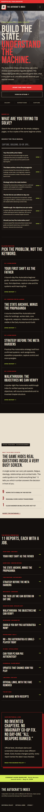
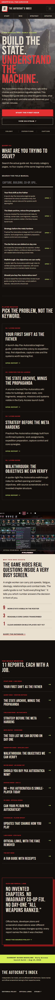
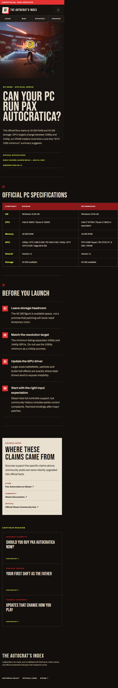
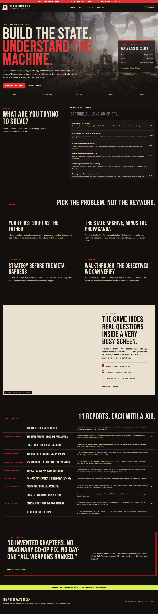
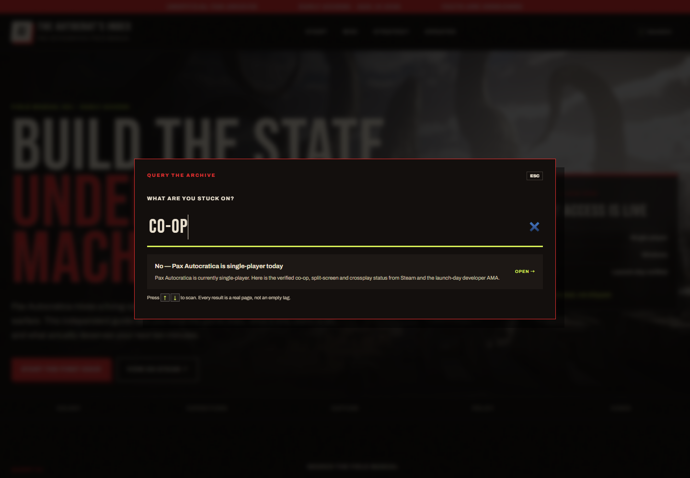
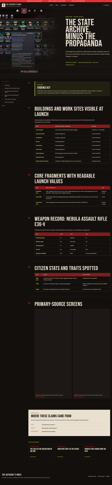
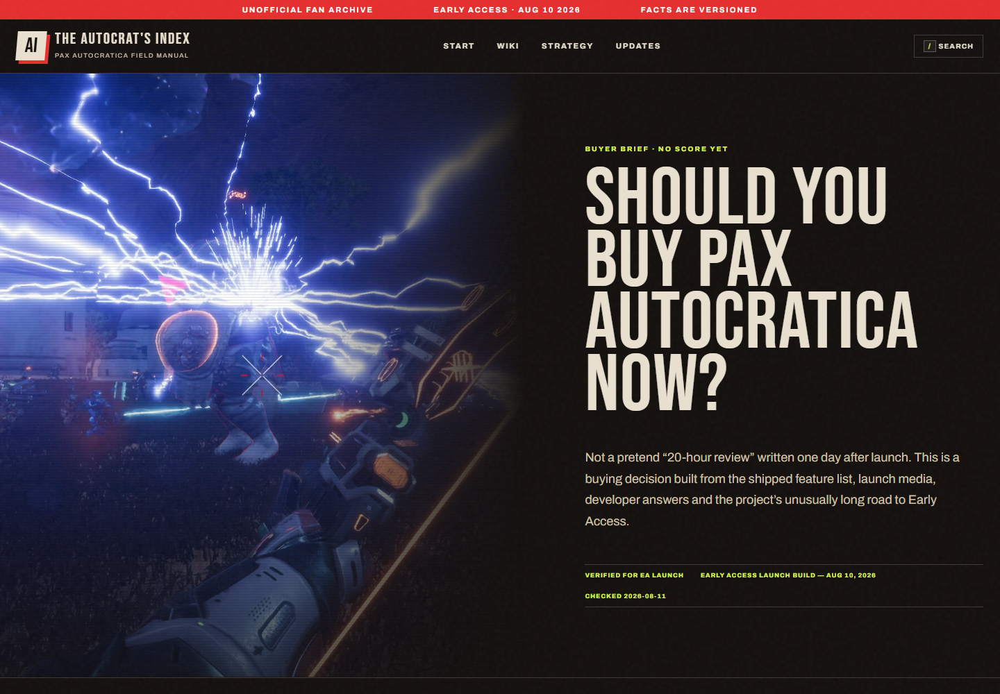

# 浏览器 Dogfood 验收：The Autocrat’s Index

| 字段 | 结果 |
|---|---|
| 日期 | 2026-08-12 |
| 验收地址 | `http://localhost:4322/`（Astro 静态 Preview） |
| Session | `pax-wiki-qa` |
| 范围 | 首页、Wiki、Review 视频、Multiplayer 搜索落地页、Requirements 小屏表格、全路由与 404 |

## 结论

最终状态：**通过，0 个未解决问题**。测试中发现 1 个低严重度移动端导航问题，已修复并复验。没有发现 JavaScript 异常、控制台告警、失败的站内路由或明显布局溢出。

| 严重度 | 发现 | 已修复 | 未解决 |
|---|---:|---:|---:|
| Critical | 0 | 0 | 0 |
| High | 0 | 0 | 0 |
| Medium | 0 | 0 | 0 |
| Low | 1 | 1 | 0 |

## ISSUE-001：小屏文章页缺少直接主导航

| 字段 | 内容 |
|---|---|
| 严重度 | Low |
| 分类 | UX / responsive navigation |
| URL | `/` 与所有文章页 |
| 状态 | 已修复 |

在 390×844 视口中，桌面主导航被隐藏，用户需要依靠搜索、首页内容卡或文末相关阅读跳转。修复是在全站 Header 下增加只在 1000px 以下显示的四项快速导航（Start、Wiki、Strategy、Updates），保留搜索入口且不挤压品牌行。

1. 修复前手机首页：
2. 修复后手机首页：
3. 修复后配置页与横向表格：

## 关键流程证据

- 桌面首页视觉与完整长页：
- 搜索 `co-op` 只返回真实 Multiplayer 页面，并成功导航：
- Wiki 的建筑、Core Fragment、武器与 citizen 表格在桌面可读：
- Review 提供带本地官方截图封面的 trailer 入口，点击在 YouTube 打开官方视频。验收时发现第三方 iframe 在当前网络下显示破图，因此改为可靠的官方直链，避免把用户留在坏状态：
- 所有 12 个公开路由返回 200，自定义缺失路由返回 404。
- 首页 Web Vitals 本地快照：TTFB 2.4ms、FCP 156ms、CLS 0；本地值只用于回归，不代表公网性能。
- `squirrel` CLI 在本机不可用，因此没有伪造其分数；以 Astro check、内容合同、静态 HTML 审计、路由 smoke 和真实浏览器 dogfood 代替。
